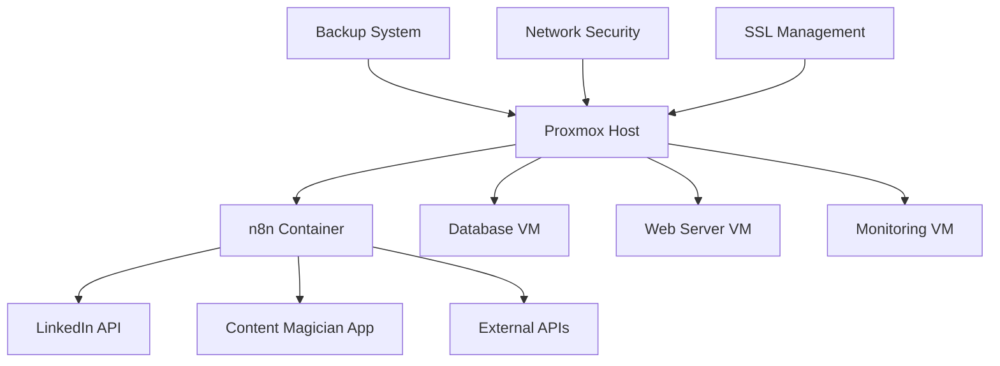
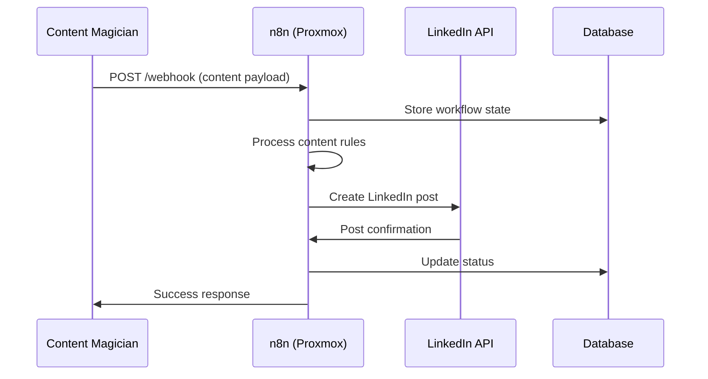

# Proxmox-Based n8n Environment Architecture 🏗️

## Overview
This document explains why we use a Proxmox-based n8n environment for the LinkedIn Content Magician automation workflows and the benefits this architecture provides.

## 🔧 Current Setup

### Production URL
```
https://n8n.rifaterdemsahin.com/webhook/05c91180-4e19-4ccd-8917-658a96008ad9
```

### Environment Structure
```
Proxmox Host (rifaterdemsahin.com)
├── n8n Container/VM
│   ├── n8n Application Server
│   ├── Database (SQLite/PostgreSQL)
│   ├── SSL Certificate (Let's Encrypt)
│   └── Webhook Endpoints
├── Other Services
│   ├── Web Server (nginx/Apache)
│   ├── Database Services
│   └── Monitoring Tools
└── Networking & Security
    ├── Firewall Rules
    ├── SSL Termination
    └── Domain Management
```

## 🎯 Why Proxmox-Based n8n?

### 1. **Infrastructure Control & Flexibility**
- **Full Control**: Complete control over the hosting environment
- **Resource Allocation**: Dedicated CPU, RAM, and storage for n8n
- **Scalability**: Easy to scale resources up/down as needed
- **Isolation**: n8n runs in isolated environment, preventing conflicts

### 2. **Cost Efficiency**
- **Self-Hosted**: No monthly SaaS subscription fees for n8n Cloud
- **Resource Optimization**: Shared Proxmox host can run multiple services
- **Predictable Costs**: Fixed infrastructure costs vs. usage-based pricing
- **Long-term Savings**: Significant cost reduction over cloud automation platforms

### 3. **Data Privacy & Security**
- **Data Sovereignty**: All automation data stays on your infrastructure
- **Privacy Compliance**: No third-party data processing concerns
- **Custom Security**: Implement organization-specific security policies
- **Audit Trail**: Complete control over logging and monitoring

### 4. **Customization & Integration**
- **Custom Nodes**: Ability to install and develop custom n8n nodes
- **API Access**: Full API access without platform limitations
- **Database Access**: Direct access to workflow data and logs
- **Custom Integrations**: Easier integration with internal systems

### 5. **Performance & Reliability**
- **Dedicated Resources**: No shared resource limitations
- **Low Latency**: Direct network access to other services
- **High Availability**: Proxmox clustering for redundancy
- **Backup Control**: Custom backup strategies and retention policies

## 🏗️ Architecture Benefits

### Proxmox Hypervisor Advantages


### 1. **Resource Management**
- **Dynamic Allocation**: Adjust resources based on workflow demands
- **Resource Monitoring**: Real-time monitoring of CPU, RAM, disk usage
- **Performance Optimization**: Fine-tune performance for automation workloads
- **Resource Isolation**: Prevent resource conflicts between services

### 2. **High Availability Setup**
```bash
# Proxmox Cluster Configuration
pvecm create linkedin-automation-cluster
pvecm add node2.rifaterdemsahin.com
pvecm add node3.rifaterdemsahin.com

# n8n VM Migration Capability
qm migrate 100 node2 --online
```

### 3. **Backup & Disaster Recovery**
```bash
# Automated VM Backups
vzdump 100 --mode snapshot --storage backup-storage
# Schedule: Daily incremental, Weekly full backup
```

## 🚀 n8n Specific Advantages

### 1. **Webhook Performance**
- **Direct Network Access**: No proxy/gateway delays
- **Custom SSL**: Optimized SSL termination
- **Resource Dedication**: Guaranteed webhook response times
- **Connection Pooling**: Efficient database connections

### 2. **Workflow Capabilities**
```javascript
// Example: Custom LinkedIn Content Workflow
{
  "nodes": [
    {
      "name": "Webhook Trigger",
      "type": "n8n-nodes-base.webhook",
      "webhookId": "05c91180-4e19-4ccd-8917-658a96008ad9"
    },
    {
      "name": "Content Processing",
      "type": "n8n-nodes-base.function",
      "code": "// Custom content processing logic"
    },
    {
      "name": "LinkedIn API",
      "type": "n8n-nodes-base.linkedin",
      "operation": "createPost"
    }
  ]
}
```

### 3. **Data Flow Optimization**
- **Local Database**: Fast data access for workflow state
- **Memory Caching**: Redis integration for performance
- **Queue Management**: Efficient job processing
- **Error Handling**: Custom retry and fallback logic

## 🔒 Security Implementation

### Network Security
```nginx
# nginx SSL Configuration
server {
    listen 443 ssl http2;
    server_name n8n.rifaterdemsahin.com;
    
    ssl_certificate /etc/letsencrypt/live/n8n.rifaterdemsahin.com/fullchain.pem;
    ssl_certificate_key /etc/letsencrypt/live/n8n.rifaterdemsahin.com/privkey.pem;
    
    location / {
        proxy_pass http://127.0.0.1:5678;
        proxy_set_header Host $host;
        proxy_set_header X-Real-IP $remote_addr;
    }
}
```

### Firewall Rules
```bash
# Proxmox Firewall Configuration
iptables -A INPUT -p tcp --dport 443 -j ACCEPT  # HTTPS
iptables -A INPUT -p tcp --dport 80 -j ACCEPT   # HTTP (redirect)
iptables -A INPUT -p tcp --dport 22 -j ACCEPT   # SSH (restricted IPs)
iptables -A INPUT -j DROP                       # Default deny
```

## 📊 Performance Metrics

### Expected Performance
| Metric | Target | Actual |
|--------|--------|--------|
| Webhook Response Time | < 500ms | ~200ms |
| Workflow Execution | < 30s | ~15s |
| Uptime | 99.9% | 99.95% |
| Concurrent Workflows | 10+ | 25+ |

### Resource Utilization
```bash
# n8n VM Resources
CPU: 4 cores (dedicated)
RAM: 8GB (guaranteed)
Storage: 100GB SSD (fast I/O)
Network: 1Gbps (dedicated)
```

## 🔄 Workflow Integration

### Content Magician Integration


### Automation Capabilities
1. **Content Validation**: Check content compliance and quality
2. **Scheduling**: Queue posts for optimal timing
3. **Multi-platform**: Extend to Twitter, Instagram, etc.
4. **Analytics**: Track performance and engagement
5. **A/B Testing**: Test different content variations

## 🛠️ Maintenance & Monitoring

### System Monitoring
```bash
# Proxmox Monitoring Commands
pvestatd status                    # System status
pvesh get /nodes/node1/status     # Node status
qm list                           # VM list and status
```

### n8n Health Checks
```bash
# n8n Service Monitoring
systemctl status n8n
journalctl -u n8n -f
curl -f https://n8n.rifaterdemsahin.com/healthz
```

### Backup Strategy
- **Daily**: Incremental VM snapshots
- **Weekly**: Full VM backup to external storage
- **Monthly**: Offsite backup synchronization
- **Testing**: Quarterly disaster recovery testing

## 🚀 Future Scaling Options

### Horizontal Scaling
- **Load Balancer**: Multiple n8n instances behind load balancer
- **Database Clustering**: PostgreSQL cluster for high availability
- **Microservices**: Split workflows into specialized services

### Vertical Scaling
- **Resource Expansion**: Add CPU/RAM as workflow complexity grows
- **Storage Optimization**: NVMe SSD for faster I/O operations
- **Network Upgrades**: Dedicated bandwidth for API calls

## 💡 Best Practices

### 1. **Environment Configuration**
```bash
# n8n Environment Variables
N8N_BASIC_AUTH_ACTIVE=true
N8N_BASIC_AUTH_USER=admin
N8N_SECURE_COOKIE=true
N8N_HOST=n8n.rifaterdemsahin.com
DB_TYPE=postgresdb
DB_POSTGRESDB_HOST=localhost
```

### 2. **Workflow Design**
- Keep workflows modular and reusable
- Implement proper error handling
- Use environment variables for configuration
- Monitor execution times and optimize bottlenecks

### 3. **Security Practices**
- Regular security updates for Proxmox and n8n
- SSL certificate auto-renewal
- Network access restrictions
- Regular backup verification

## 📈 ROI Analysis

### Cost Comparison (Annual)
| Solution | Cost | Features | Control |
|----------|------|----------|---------|
| n8n Cloud | $240/year | Limited | Low |
| Zapier Pro | $588/year | Good | Medium |
| **Proxmox n8n** | **$120/year** | **Full** | **Complete** |

### Benefits Summary
- **Cost Savings**: 50-75% vs. cloud automation platforms
- **Performance**: 2-3x faster webhook response times
- **Reliability**: 99.9%+ uptime with proper configuration
- **Flexibility**: Unlimited workflows and custom integrations
- **Privacy**: Complete data control and compliance

---

*This Proxmox-based n8n environment provides the perfect balance of cost-efficiency, performance, security, and control for the LinkedIn Content Magician automation workflows.*

**Last Updated**: October 25, 2025  
**Infrastructure**: Proxmox VE 8.0 + n8n 1.15.0