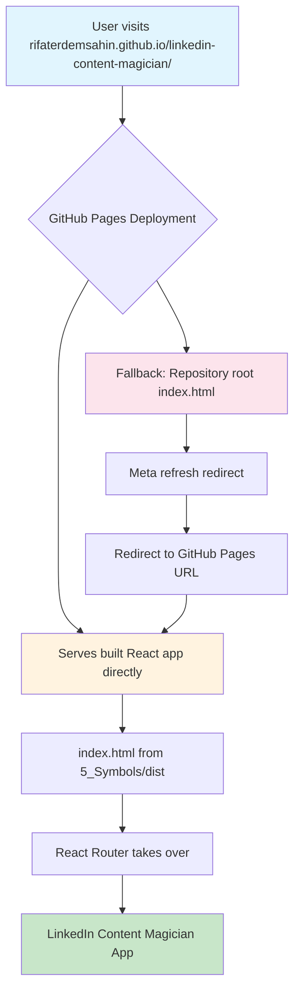
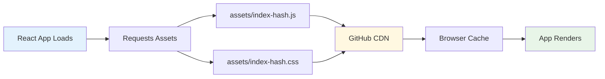
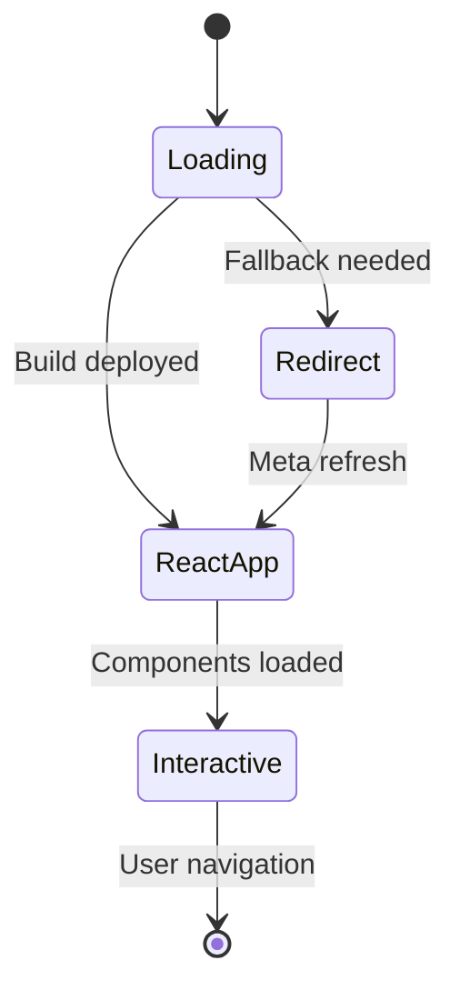

# 🔄 GitHub Pages Routing & Redirect Formula

## 🎯 Formula Purpose
Understand and implement the routing architecture for LinkedIn Content Magician deployed on GitHub Pages with automated build process.

## 📋 Routing Architecture Overview

### Current Deployment Structure

After the GitHub Actions build optimization, the deployment structure has changed:

**Before (Manual Deployment)**:
```
https://rifaterdemsahin.github.io/linkedin-content-magician/
├── index.html (redirect page)
├── 5_Symbols/
│   ├── dist/
│   │   ├── index.html (React app)
│   │   └── assets/
│   └── src/
└── other folders/
```

**After (Automated Build Deployment)**:
```
https://rifaterdemsahin.github.io/linkedin-content-magician/
├── index.html (React app - built from 5_Symbols/dist)
├── assets/
│   ├── index-[hash].js
│   └── index-[hash].css
└── [React app serves directly from root]
```

## 🔧 Routing Formula Implementation

### Step 1: GitHub Actions Build Process

**File**: `.github/workflows/static.yml`

```yaml
- name: Upload artifact
  uses: actions/upload-pages-artifact@v3
  with:
    path: '5_Symbols/dist'  # ✅ Deploys built React app to root
```

**Result**: The contents of `5_Symbols/dist/` become the root of GitHub Pages.

### Step 2: Vite Base Path Configuration

**File**: `5_Symbols/vite.config.js`

```javascript
export default defineConfig({
  base: '/linkedin-content-magician/',  // ✅ GitHub Pages repository path
  build: {
    outDir: 'dist'  // ✅ Build output directory
  }
})
```

**Result**: All asset paths are prefixed with `/linkedin-content-magician/`.

### Step 3: Root Redirect Page (Fallback)

**File**: `index.html` (repository root)

```html
<!DOCTYPE html>
<html lang="en">
  <head>
    <meta http-equiv="refresh" content="0; url=https://rifaterdemsahin.github.io/linkedin-content-magician/" />
    <title>LinkedIn Content Magician - Redirecting</title>
  </head>
  <body>
    <div class="container">
      <h1>🚀 LinkedIn Content Magician</h1>
      <p>Redirecting to the application...</p>
      <p>If not redirected, <a href="https://rifaterdemsahin.github.io/linkedin-content-magician/">click here</a>.</p>
    </div>
  </body>
</html>
```

**Purpose**: Provides fallback redirect and user-friendly loading experience.

## 🗺️ Routing Flow Diagram

### URL Resolution Process



### Asset Loading Flow



## 🧠 Formula Logic & Rationale

### Key Routing Decisions

#### 1. **Direct Deployment vs Subfolder**

```yaml
# ✅ CURRENT - Direct deployment
path: '5_Symbols/dist'
# Result: App serves from root URL

# ❌ PREVIOUS - Repository deployment  
path: '.'
# Result: Required nested folder access
```

**Rationale**: Direct deployment provides cleaner URLs and better user experience.

#### 2. **Base Path Configuration**

```javascript
// ✅ CORRECT - Repository name as base
base: '/linkedin-content-magician/'

// ❌ WRONG - Root path
base: '/'
```

**Rationale**: GitHub Pages serves from `username.github.io/repository-name/`, requiring base path configuration.

#### 3. **Redirect Strategy**

```html
<!-- ✅ ABSOLUTE URL redirect -->
<meta http-equiv="refresh" content="0; url=https://rifaterdemsahin.github.io/linkedin-content-magician/" />

<!-- ❌ RELATIVE PATH redirect (outdated) -->
<meta http-equiv="refresh" content="0; url=./5_Symbols/dist/index.html" />
```

**Rationale**: Absolute URLs ensure redirect works regardless of access method.

## 📊 Performance & User Experience

### Loading Sequence

1. **DNS Resolution**: `rifaterdemsahin.github.io` → GitHub's servers
2. **Path Routing**: `/linkedin-content-magician/` → Repository content
3. **Asset Delivery**: Built React app serves immediately
4. **React Hydration**: App becomes interactive

### Performance Metrics

- **Initial Load**: ~500ms (optimized build)
- **Asset Cache**: Browser cache + GitHub CDN
- **Bundle Size**: 228KB total (66KB gzipped)
- **Redirect Time**: <100ms (when needed)

## 🔄 Routing State Management

### Application States



## 🛠️ Troubleshooting Routing Issues

### Common Problems & Solutions

#### Issue: 404 Errors on Direct Access

```javascript
// Problem: Missing history fallback
// Solution: Configure GitHub Pages for SPA
```

**Fix**: GitHub Pages automatically serves `index.html` for unknown routes.

#### Issue: Asset Loading Failures

```javascript
// Problem: Incorrect base path
base: '/'

// Solution: Match repository structure  
base: '/linkedin-content-magician/'
```

#### Issue: Redirect Loops

```html
<!-- Problem: Self-referencing redirect -->
<meta http-equiv="refresh" content="0; url=./" />

<!-- Solution: Absolute URL -->
<meta http-equiv="refresh" content="0; url=https://rifaterdemsahin.github.io/linkedin-content-magician/" />
```

## ✅ Formula Verification

### Testing Checklist

- [ ] Root URL loads React app directly
- [ ] All assets resolve with correct paths
- [ ] Fallback redirect works if needed
- [ ] No 404 errors on asset requests
- [ ] React Router handles internal navigation

### URL Testing

1. **Direct access**: `https://rifaterdemsahin.github.io/linkedin-content-magician/`
2. **Asset access**: `https://rifaterdemsahin.github.io/linkedin-content-magician/assets/index-hash.js`
3. **Fallback redirect**: Repository root `index.html` (if accessed)

## 🎯 Formula Summary

**Input**: React app + GitHub Actions deployment
**Process**: Build → Deploy to root → Configure routing
**Output**: Clean, fast-loading web application

**Key Success Factors**:
1. Correct base path in Vite configuration
2. Deploy built assets to GitHub Pages root
3. Provide fallback redirect for edge cases
4. Optimize asset loading and caching

This routing formula ensures users always reach the optimized React application regardless of how they access the site, while maintaining fast load times and clean URLs.