# Formula: Post Processing Workflow 📝

## Overview
This document explains the complete post processing workflow in the LinkedIn Content Magician system, from seed data input to final LinkedIn publication.

## 🚀 Process Flow Diagram

```mermaid
graph TD
    A[📊 Seed Data Input] --> B[⚡ RAG Processing]
    B --> C[📝 Content Generation]
    C --> D[🔍 Debug Capture]
    D --> E[👁️ Human Review]
    E --> F{Approval Decision}
    F -->|Approve| G[🚀 Release Prompts Generation]
    F -->|Reject| H[❌ Content Rejected]
    G --> I[📦 n8n Payload Creation]
    I --> J[🔗 Webhook Transmission]
    J --> K[🌐 LinkedIn Publishing]
    K --> L[📊 Analytics Tracking]
```



## 📋 Stage-by-Stage Breakdown

### Stage 1: 📊 Seed Data Collection
**Purpose**: Gather raw content ideas from various sources

**Input Sources**:
- Weekly stream whiteboard notes
- Brainstorming session transcripts
- Client case studies
- Technical discoveries
- Industry observations

**Data Format**:
```javascript
{
  inputPrompt: "Raw user input text",
  timestamp: "2025-10-25T14:30:00.000Z",
  source: "weekly_stream" | "whiteboard" | "brainstorm"
}
```

**Quality Criteria**:
- Minimum 50 characters
- Contains actionable insights
- Relates to target audience
- Has practical applications

---

### Stage 2: ⚡ RAG Processing
**Purpose**: Enhance seed data with historical content and patterns

**RAG Components**:
1. **Retrieval**: Search indexed content library
2. **Augmentation**: Enhance with historical patterns
3. **Generation**: Create contextually relevant content

**Processing Steps**:
```javascript
// 1. Vector similarity search
const relevantSources = await vectorDB.search(prompt, {
  limit: 5,
  threshold: 0.7
});

// 2. Context augmentation
const enhancedPrompt = augmentWithHistory(prompt, relevantSources);

// 3. Style pattern matching
const voicePatterns = analyzeWritingStyle(userHistory);
```

**Retrieved Data Structure**:
```javascript
{
  ragSources: [
    "Previous LinkedIn post about automation",
    "Video transcript from tech talk", 
    "Article draft on AI implementation",
    "Whiteboard notes from strategy session",
    "Client feedback on similar topics"
  ],
  relevanceScores: [0.95, 0.87, 0.82, 0.79, 0.75],
  contextualInsights: {
    tone: "professional_conversational",
    frameworks: ["3-step process", "problem-solution"],
    hashtags: ["#Innovation", "#Technology", "#Strategy"]
  }
}
```

---

### Stage 3: 📝 Content Generation
**Purpose**: Generate authentic LinkedIn content in user's voice

**Template Selection Algorithm**:
```javascript
const templates = [
  "insight_sharing",     // 🎯 Discovery format
  "framework_teaching",  // 🧠 Educational format  
  "opinion_contrarian"   // 🔥 Debate format
];

const selectedTemplate = selectByContext(prompt, userHistory);
```

**Content Structure**:
- **Hook**: Attention-grabbing opening (15-30 chars)
- **Context**: Problem or observation setup
- **Insight**: Key learning or framework
- **Application**: Practical implementation
- **Engagement**: Question or call-to-action
- **Hashtags**: Relevant topic tags (3-5)

**Generated Content Metrics**:
```javascript
{
  characterCount: 450,
  wordCount: 85,
  hashtags: 3,
  emojis: 8,
  engagementScore: 0.85,
  readabilityScore: "B+"
}
```

---

### Stage 4: 🔍 Debug Capture
**Purpose**: Provide transparency and debugging capabilities

**Debug Data Structure**:
```javascript
{
  timestamp: "2025-10-25T14:30:00.000Z",
  processingSteps: [
    "🕐 [14:30:15] Starting content generation process",
    "📥 Input prompt: 'AI automation in marketing'",
    "🔍 [14:30:16] RAG retrieval completed",
    "📊 Found 5 relevant sources",
    "✨ [14:30:18] Content generation completed",
    "📝 Generated 450 characters of content",
    "📦 [14:30:19] n8n payload prepared"
  ],
  inputPrompt: "Original user input",
  ragSources: ["source1", "source2", ...],
  generatedContent: "Full LinkedIn post text",
  n8nPayload: { /* Complete webhook payload */ }
}
```

**Debug Window Features**:
- Real-time processing logs
- RAG source visualization
- Content preview
- Payload inspection
- Copy/export functionality

---

### Stage 5: 👁️ Human Review
**Purpose**: Human-in-the-loop quality control

**Review Interface**:
- Content preview with formatting
- Approve/Reject buttons
- Generate Release Prompts option
- Edit capability (future enhancement)

**Decision Points**:
- Content quality assessment
- Brand voice alignment
- Factual accuracy check
- Engagement potential evaluation

---

### Stage 6: 🚀 Release Prompts Generation
**Purpose**: Create comprehensive content ecosystem

**Prompt Categories**:

1. **📝 Text Content** (5 types):
   - LinkedIn Carousel (10 slides)
   - Twitter Thread (8-12 tweets)
   - Blog Article Outline
   - Video Script (3-5 min)
   - Email Newsletter

2. **🎨 Image Generation** (5 types):
   - Hero Image (1200x627px)
   - Infographic Design
   - Carousel Slides (1080x1080px)
   - Quote Graphics
   - Video Thumbnail

3. **🎥 Video Content** (3 types):
   - Short-form (TikTok/Reels)
   - YouTube Video (10-15 min)
   - Tutorial Video

4. **📈 Marketing** (2 types):
   - Social Media Campaign (7-day)
   - Landing Page Copy

**Prompt Template Structure**:
```javascript
{
  title: "LinkedIn Carousel Post",
  prompt: `Create a 10-slide LinkedIn carousel about "${topic}":
- Slide 1: Hook/Title
- Slides 2-8: Key points with actionable insights
- Slide 9: Call-to-action
- Slide 10: About me/contact

Use this content as reference: ${baseContent}`
}
```

---

### Stage 7: 📦 n8n Payload Creation
**Purpose**: Prepare data for automation workflow

**Complete Payload Structure**:
```javascript
{
  // Metadata
  timestamp: "2025-10-25T14:30:00.000Z",
  source: "LinkedIn Content Magician",
  version: "1.0.0",
  
  // Original Data
  originalPrompt: "User seed data",
  
  // Generated Content
  generatedContent: "Full LinkedIn post",
  
  // RAG Context
  ragSources: ["source1", "source2", ...],
  
  // Content Analytics
  contentMetrics: {
    characterCount: 450,
    wordCount: 85,
    hashtags: 3,
    emojis: 8,
    sentiment: "positive",
    topics: ["AI", "automation", "marketing"]
  },
  
  // Platform Configuration
  platform: "linkedin",
  contentType: "post",
  scheduling: {
    publishImmediately: false,
    scheduledTime: "2025-10-25T16:00:00.000Z"
  },
  
  // Status Tracking
  status: "ready_for_review",
  reviewedBy: "human",
  approvalTimestamp: "2025-10-25T14:35:00.000Z"
}
```

---

### Stage 8: 🔗 Webhook Transmission
**Purpose**: Send data to n8n automation workflow

**Technical Details**:
- **Method**: POST
- **URL**: `https://n8n.rifaterdemsahin.com/webhook/05c91180-4e19-4ccd-8917-658a96008ad9`
- **Headers**: 
  ```json
  {
    "Content-Type": "application/json",
    "User-Agent": "LinkedIn-Content-Magician/1.0.0",
    "X-Debug-Request": "true"
  }
  ```

**Error Handling**:
- Connection timeout (30s)
- Retry logic (3 attempts)
- Fallback storage
- Debug logging

**Response Processing**:
```javascript
if (response.ok) {
  log("✅ Successfully sent to n8n");
  updateStatus("transmitted");
} else {
  log(`❌ HTTP Error: ${response.status}`);
  handleError(response);
}
```

---

### Stage 9: 🌐 LinkedIn Publishing
**Purpose**: Automated posting to LinkedIn via n8n

**n8n Workflow Steps**:
1. **Webhook Trigger**: Receive payload from app
2. **Content Validation**: Check formatting and compliance
3. **LinkedIn API**: Authenticate and post content
4. **Response Handling**: Process success/failure
5. **Notification**: Send confirmation to user

**LinkedIn API Integration**:
```javascript
// n8n workflow node configuration
{
  "nodeType": "LinkedIn",
  "operation": "createPost",
  "parameters": {
    "text": "{{$json.generatedContent}}",
    "visibility": "PUBLIC",
    "media": [] // Future: image attachments
  }
}
```

---

### Stage 10: 📊 Analytics Tracking
**Purpose**: Monitor content performance and optimize

**Metrics Collected**:
- Post reach and impressions
- Engagement rate (likes, comments, shares)
- Click-through rate (if links included)
- Audience demographics
- Optimal posting times

**Performance Analysis**:
```javascript
{
  postId: "linkedin_post_123",
  metrics: {
    impressions: 1250,
    likes: 45,
    comments: 8,
    shares: 12,
    clicks: 23,
    engagementRate: 7.04
  },
  insights: {
    bestPerformingHashtags: ["#Innovation", "#AI"],
    optimalPostingTime: "14:00 GMT",
    audienceReach: "primarily_technical_professionals"
  }
}
```

## 🔄 Continuous Improvement Loop

### Feedback Integration
1. **Performance Data** → RAG Training
2. **User Preferences** → Template Optimization  
3. **Engagement Patterns** → Content Strategy
4. **Error Logs** → System Reliability

### Quality Assurance
- Content quality scoring
- Brand voice consistency checks
- Engagement prediction models
- A/B testing frameworks

## 🛠️ Technical Implementation

### Key Functions
```javascript
// Main processing pipeline
async function processContent(seedData) {
  const debugLogger = new DebugLogger();
  
  try {
    // Stage 1: RAG Processing
    const ragResults = await performRAGRetrieval(seedData);
    debugLogger.log("RAG processing completed");
    
    // Stage 2: Content Generation
    const content = await generateContent(seedData, ragResults);
    debugLogger.log("Content generated");
    
    // Stage 3: Payload Preparation
    const payload = await prepareN8nPayload(content, ragResults);
    debugLogger.log("Payload prepared");
    
    // Stage 4: Debug Capture
    const debugData = debugLogger.export();
    
    return { content, payload, debugData };
    
  } catch (error) {
    debugLogger.error("Processing failed", error);
    throw error;
  }
}
```

### Error Handling Strategy
- Graceful degradation for API failures
- Retry mechanisms with exponential backoff
- Comprehensive logging for debugging
- User-friendly error messages

### Performance Optimization
- Async processing for non-blocking operations
- Caching for RAG retrieval results
- Batch processing for multiple posts
- Resource cleanup and memory management

## 📈 Success Metrics

### System Performance
- **Processing Time**: < 3 seconds per post
- **Success Rate**: > 95% successful generations
- **Error Recovery**: < 1% unrecoverable failures

### Content Quality
- **Engagement Rate**: Target 5%+ average
- **Brand Consistency**: 90%+ voice match score
- **User Satisfaction**: 4.5/5 average rating

### Operational Efficiency
- **Manual Intervention**: < 10% of posts require editing
- **Time Savings**: 80% reduction in content creation time
- **Scalability**: Support 100+ posts per day

## 🔮 Future Enhancements

### Planned Features
1. **Multi-platform Publishing**: Twitter, Instagram, TikTok
2. **Advanced Analytics**: Sentiment analysis, competitor tracking
3. **Content Personalization**: Audience-specific variations
4. **Visual Content**: Auto-generated images and videos
5. **Scheduling Intelligence**: Optimal timing recommendations

### Technical Roadmap
- Real-time collaboration features
- Advanced RAG with domain-specific models
- Integration with CRM systems
- Mobile application development
- Enterprise-grade security and compliance

---

*This formula document serves as the definitive guide for understanding and implementing the post processing workflow in the LinkedIn Content Magician system.*

**Last Updated**: October 25, 2025  
**Version**: 1.0  
**Author**: LinkedIn Content Magician Team