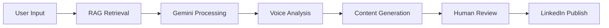

# LinkedIn Content Magician

## プロジェクトの概要

This project, "LinkedIn Content Magician," is a sophisticated platform designed to assist users in creating authentic and engaging content for LinkedIn. It leverages a Retrieval-Augmented Generation (RAG) model to ensure that the generated content aligns with the user's unique voice and style. The system is built with a combination of n8n for workflow automation, Faiss for the vector database, and a React-based frontend for the user interface.

The core of the project is to provide a seamless experience for content creators, allowing them to scale their content production without sacrificing authenticity. It includes features for content generation, review and approval, and system configuration, all accessible through a user-friendly dashboard.

## Project Structure

The project is organized into a series of folders, each serving a distinct purpose in the development and management of the application:

-   `1_Real`: This directory defines the project's high-level objectives and key results, setting the strategic goals for the Content Magician.
-   `2_Environment`: Here, you'll find the project roadmap and various use cases, which guide the development and application of new features.
-   `3_UI`: This folder is dedicated to the user interface, tracking the concepts, theories, and skills acquired during the development process.
-   `4_Formula`: Contains essential guides, formulas, and references that are crucial for understanding and solving challenges within the project.
-   `5_Symbols`: This is where the implemented code resides, including the main `index.html` of the application and other key scripts.
-   `6_Semblance`: A directory for documenting errors, mistakes, and their corresponding solutions, turning them into valuable learning opportunities.
-   `7_Testing`: This folder is designated for all testing activities, ensuring that the codebase meets the key results outlined in the `1_Real` directory.

## Key Technologies

The LinkedIn Content Magician is built on a modern tech stack, carefully chosen to provide a robust and scalable solution:

-   **Retrieval-Augmented Generation (RAG)**: The core AI technology used for generating content that is both high-quality and authentic to the user's voice.
-   **Faiss**: A library for efficient similarity search and clustering of dense vectors, used as the vector database for the RAG model.
-   **n8n**: An extendable workflow automation tool that orchestrates the various components of the content generation process.
-   **React**: A popular JavaScript library for building user interfaces, used to create the interactive and user-friendly dashboard.
-   **Telegram Integration**: The system is designed to integrate with Telegram for notifications and human-in-the-loop content approval.

## AI Integration Roadmap

This section outlines the planned integration of Google Gemini AI into the LinkedIn Content Magician platform, aiming to enhance its capabilities and provide a more intelligent content creation experience.

### Integration Objectives

-   **Enhanced Content Generation**: Leverage Gemini's advanced language capabilities for more sophisticated content creation.
-   **Multi-Modal Content**: Utilize Gemini's vision capabilities for image-based content suggestions.
-   **Voice Consistency**: Train Gemini to maintain an authentic personal voice across all generated content.
-   **Real-time Optimization**: Dynamically optimize content based on engagement patterns and real-time feedback.

### Technical Implementation

#### API Integration

```javascript
// Example Gemini API integration
const geminiConfig = {
  apiKey: process.env.GEMINI_API_KEY,
  model: 'gemini-pro',
  temperature: 0.7,
  maxTokens: 1000
};

async function generateWithGemini(prompt, context) {
  const enhancedPrompt = `
    Context: ${context}
    Brand Voice: Professional, authentic, insightful
    Platform: LinkedIn
    Goal: Generate engaging professional content
    
    Prompt: ${prompt}
  `;
  
  // Gemini API call implementation
}
```

#### RAG Enhancement

-   **Vector Embeddings**: Use Gemini's embedding capabilities for better semantic search.
-   **Context Enrichment**: Enhance RAG retrieval with Gemini's deep understanding of context.
-   **Multi-turn Conversations**: Implement conversational content refinement for a more interactive experience.

#### Content Optimization Pipeline



This updated `gemini.md` provides a comprehensive overview of the LinkedIn Content Magician project, from its current state to its future ambitions with AI integration.
