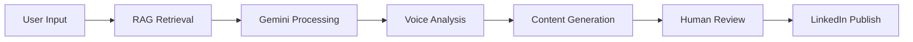

# 🤖 Gemini AI Integration Guide

## LinkedIn Content Magician × Google Gemini

This document outlines the integration possibilities and implementation strategies for incorporating Google Gemini AI into the LinkedIn Content Magician platform.

### 🎯 Integration Objectives

- **Enhanced Content Generation**: Leverage Gemini's advanced language capabilities for more sophisticated content creation
- **Multi-Modal Content**: Utilize Gemini's vision capabilities for image-based content suggestions
- **Voice Consistency**: Train Gemini to maintain authentic personal voice across generated content
- **Real-time Optimization**: Dynamic content optimization based on engagement patterns

### 🔧 Technical Implementation

#### 1. API Integration
```javascript
// Example Gemini API integration
const geminiConfig = {
  apiKey: process.env.GEMINI_API_KEY,
  model: 'gemini-pro',
  temperature: 0.7,
  maxTokens: 1000
};

async function generateWithGemini(prompt, context) {
  const enhancedPrompt = `
    Context: ${context}
    Brand Voice: Professional, authentic, insightful
    Platform: LinkedIn
    Goal: Generate engaging professional content
    
    Prompt: ${prompt}
  `;
  
  // Gemini API call implementation
}
```

#### 2. RAG Enhancement
- **Vector Embeddings**: Use Gemini's embedding capabilities for better semantic search
- **Context Enrichment**: Enhance RAG retrieval with Gemini's understanding
- **Multi-turn Conversations**: Implement conversational content refinement

#### 3. Content Optimization Pipeline


### 🚀 Features & Capabilities

#### Content Generation
- **Thought Leadership**: Generate insightful industry commentary
- **Personal Stories**: Craft authentic personal narratives
- **Technical Insights**: Explain complex concepts simply
- **Engagement Hooks**: Create compelling opening lines

#### Multi-Modal Processing
- **Image Analysis**: Generate captions for visual content
- **Document Processing**: Extract insights from PDFs, presentations
- **Video Transcription**: Convert video content to written posts

#### Voice Adaptation
- **Writing Style Learning**: Analyze existing posts to understand voice
- **Tone Adjustment**: Adapt content tone based on topic and audience
- **Brand Consistency**: Maintain consistent messaging across all content

### 📊 Integration Architecture

#### Current Stack Enhancement
```yaml
Frontend:
  - React Application (existing)
  - Gemini Chat Interface (new)
  - Real-time Preview (enhanced)

Backend:
  - n8n Workflows (existing)
  - Gemini API Layer (new)
  - Vector Database (existing - Faiss)

AI Layer:
  - RAG System (existing)
  - Gemini Pro (new)
  - Voice Analysis (enhanced)

Storage:
  - Content Database (existing)
  - Gemini Conversations (new)
  - Performance Analytics (new)
```

### 🔄 Workflow Integration

#### 1. Content Ideation
```
User Topic → Gemini Research → RAG Context → Content Outline
```

#### 2. Content Creation
```
Outline → Gemini Draft → Voice Check → Human Review → Refinement
```

#### 3. Performance Learning
```
Published Content → Engagement Data → Gemini Analysis → Voice Model Update
```

### ⚙️ Configuration Options

#### Model Parameters
- **Temperature**: Control creativity (0.3-1.0)
- **Max Tokens**: Content length limits
- **Top-K/Top-P**: Response diversity
- **Safety Settings**: Content filtering levels

#### Custom Instructions
```
You are a LinkedIn content expert helping create authentic, engaging posts.
Focus on:
- Professional tone with personal touches
- Actionable insights and value
- Clear, scannable formatting
- Strong opening hooks
- Call-to-action endings

Avoid:
- Generic corporate speak
- Overly promotional content
- Buzzword-heavy language
- Long paragraphs without breaks
```

### 🔒 Security & Privacy

#### Data Protection
- **API Key Management**: Secure environment variables
- **Content Encryption**: Protect sensitive user data
- **Usage Monitoring**: Track API calls and costs
- **Compliance**: GDPR and privacy regulation adherence

#### Rate Limiting
- **Request Throttling**: Prevent API quota exhaustion
- **Queue Management**: Handle burst traffic gracefully
- **Error Handling**: Graceful degradation strategies

### 📈 Performance Metrics

#### Success Indicators
- **Content Quality**: Human approval rates
- **Engagement**: LinkedIn post performance
- **Efficiency**: Time saved in content creation
- **Voice Consistency**: Brand voice match scores

#### Monitoring Dashboard
```
- API Response Times
- Content Generation Success Rate
- User Satisfaction Scores
- Cost Per Generated Post
- Engagement Rate Trends
```

### 🛠️ Implementation Roadmap

#### Phase 1: Basic Integration (Week 1-2)
- [ ] Gemini API setup and authentication
- [ ] Basic content generation endpoint
- [ ] Simple UI integration
- [ ] Error handling and logging

#### Phase 2: RAG Enhancement (Week 3-4)
- [ ] Vector database integration with Gemini
- [ ] Context-aware content generation
- [ ] Voice consistency validation
- [ ] A/B testing framework

#### Phase 3: Advanced Features (Week 5-8)
- [ ] Multi-modal content processing
- [ ] Real-time content optimization
- [ ] Performance analytics integration
- [ ] Advanced personalization

#### Phase 4: Production Optimization (Week 9-12)
- [ ] Performance monitoring
- [ ] Cost optimization
- [ ] Scaling infrastructure
- [ ] User feedback integration

### 💡 Use Cases & Examples

#### Thought Leadership Post
```
Input: "AI impact on marketing automation"
Context: [RAG retrieval of user's previous AI content]
Gemini Output: Authentic post with personal insights and industry perspective
```

#### Personal Story
```
Input: "Learning experience with new technology"
Context: [User's background and writing style]
Gemini Output: Relatable narrative with professional lessons
```

#### Technical Explanation
```
Input: "Explain RAG to non-technical audience"
Context: [User's technical posts and simplification style]
Gemini Output: Clear, accessible explanation with practical examples
```

### 🔮 Future Enhancements

- **Voice Cloning**: Advanced personal voice replication
- **Real-time Trend Analysis**: Dynamic content adaptation
- **Multi-language Support**: Global content creation
- **Video Script Generation**: Expand beyond text content
- **Collaborative Content**: Team-based content workflows

---

**Status**: Planning Phase  
**Priority**: High  
**Estimated Implementation**: 4-6 weeks  
**Dependencies**: Gemini API access, enhanced vector database

*This document will be updated as implementation progresses.*